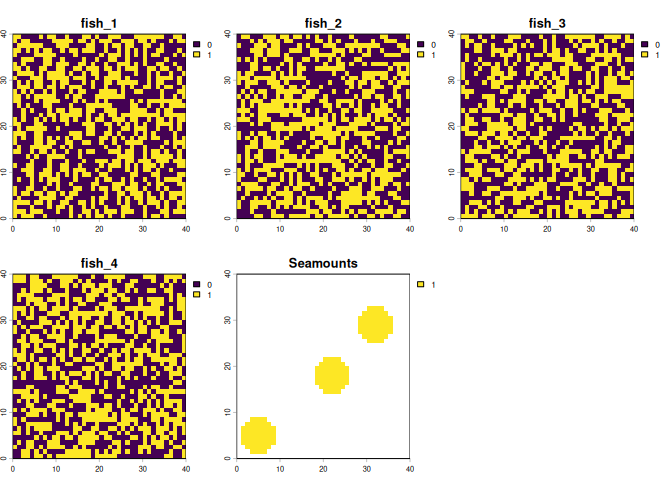
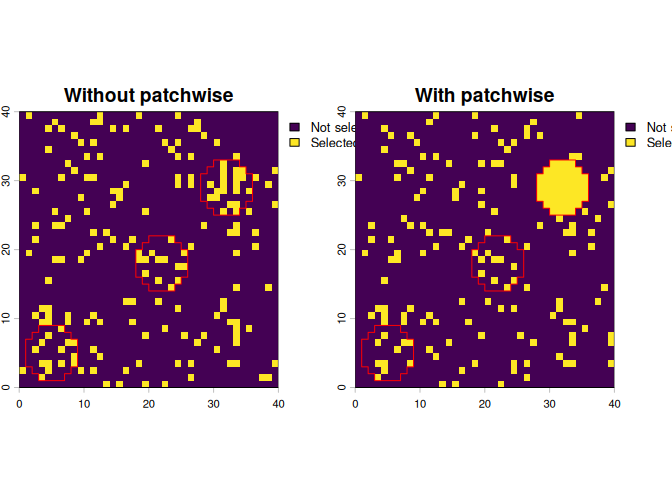
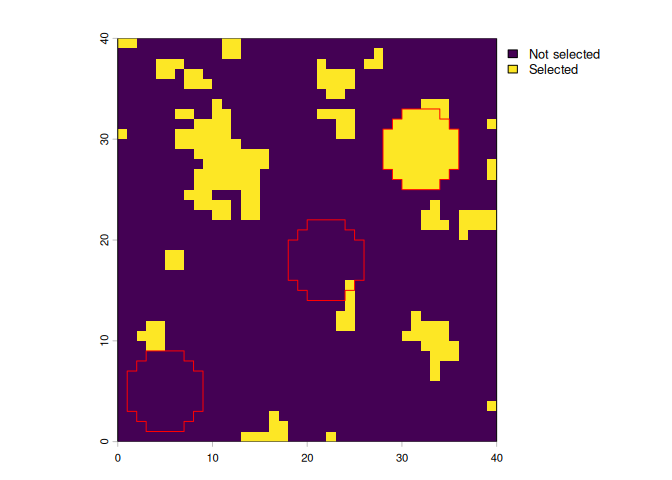
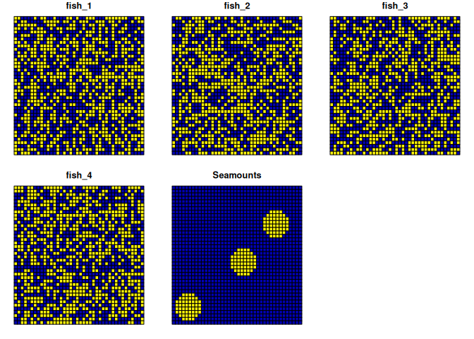
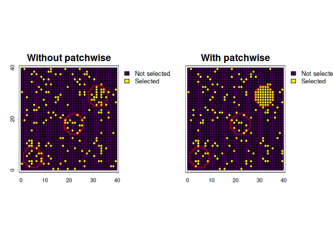

<!-- README.md is generated from README.Rmd. Please edit that file -->

# patchwise <a href="https://emlab-ucsb.github.io/patchwise/"></a>

<!-- badges: start -->

<!-- badges: end -->

`patchwise` is intended to be used as a supplementary package to
`prioritizr` for instances in which users wish to protect entire
contiguous patches of features rather than portions of many features.
For example, consider conservation planning for an area of ocean where
seamounts are one of the biodiversity features that are targeted for
protection. If the seamounts span multiple planning units and
representation target of say 20% is used, portions of many seamounts
could be protected, but it might be better to protect the entirety
(contiguous patches) of a smaller number of seamounts. `patchwise`
provides this option, ensuring that representation targets are met by
representing whole features.

## Installation

You can install the development version of `patchwise` from
[GitHub](https://github.com/) with:

``` r
# install.packages("pak")
pak::pak("emlab-ucsb/patchwise")
```

## Example using raster data

First load the libraries needed. Apart from `patchwise`, the `terra`
package is used for raster data manipulation, and `prioritizr` is used
for the spatial prioritization.

``` r
library(patchwise)
library(prioritizr)
library(terra)
```

We will import some basic planning data to demonstrate how `patchwise`
can be used. For this example we will use a a 40 x 40 raster planning
grid which has a cost value of 1 for each cell, and the following
features that will be targeted in the prioritization:

- 4 random, binary (0 or 1) data layers, representing species
  distributions; for this example we are calling them fish
- 3 “patches” of contiguous features; for this example we are calling
  them seamounts

``` r
#import planning units/ cost raster
pu_raster <- rast(system.file("extdata/pu_raster.tif", package = "patchwise"))

#import fish distributions
fish_distributions <- rast(system.file("extdata/spp_distributions.tif", package = "patchwise"))

#import seamounts
seamounts <- rast(system.file("extdata/seamounts.tif", package = "patchwise"))
```

Let’s look at our fish distributions and our seamounts

``` r
plot(c(fish_distributions, seamounts))
```



Now we can use `patchwise` to do some pre-processing of the seamounts
data so the seamounts can be prioritized as whole patches in the
following prioritization.

``` r
# Create seamount patches 
patches_rast <- create_patches(seamounts)

# Create patches dataframe - this creates constraints so that entire seamount patches are protected 
patches_df_rast <- create_patch_df(spatial_grid = pu_raster, features = fish_distributions, patches = patches_rast, costs = pu_raster)
#> Processing patch 1 of 3
#> Processing patch 2 of 3
#> Processing patch 3 of 3
```

With that pre-processing done, we can now use `patchwise` to create
protection targets for our features, including seamounts. In this
example, we will use 20%, including 20% of whole seamounts.

``` r
# Create targets for protection - 20% for each feature (including 20% of whole seamounts)
targets_rast <- features_targets(targets = rep(0.2, (nlyr(fish_distributions) + 1)), features = fish_distributions, pre_patches = seamounts)

# Add these targets to targets for protection for the "constraints" we introduced to protect entire seamount patches
constraints_rast <- constraints_targets(feature_targets = targets_rast, patch_df = patches_df_rast)
```

With all the data preparation now done, we can run a prioritization
using `prioritizr`:

The solution object is a tibble. To convert this into a raster object
for plotting, we use the `convert_solution()` function from `patchwise`

``` r
# Convert the solution into a raster using the patchwise function `convert_solution()`
sol_rast_patches <- convert_solution(solution = solution_patches_tbl, patch_df = patches_df_rast, spatial_grid = pu_raster) |>
  setNames("With patchwise")
```

For comparison, we will run a prioritization without using `patchwise`

We can now plot the solutions, and overlaying the outlines of the
seamounts (in red), we can see that one entire seamount is included in
the solution that used `patchwise`, whereas the solution without
`patchwise` selects a few planning units in each seamount. Note that in
the solution with `patchwise`, planning units that overlap seamounts
that are not entirely selected have also been selected to meet targets
for other features (fish distributions).

``` r
plot(c(solution_no_patches, sol_rast_patches), 
     fun = function()lines(as.polygons(seamounts), col = "red"),
     plg = list(legend = c("Not selected", "Selected")))
```



If you want to use a boundary penalty in the prioritization, we need to
manually create a boundary matrix using the `patchwise` function
`create_boundary_matrix()`

``` r
boundary_matrix_rast <- create_boundary_matrix(spatial_grid = pu_raster, patches = patches_rast, patch_df = patches_df_rast)
```

We can now re-run the prioritization with a boundary penalty

We now get a solution with planning units more clustered together

``` r
plot(solution_rast_boundary, plg = list(legend = c("Not selected", "Selected")))
lines(as.polygons(seamounts), col = "red")
```



## Example with sf data

The previous example used raster input data for the prioritization, but
`patchwise` also handles `sf` data.

``` r
library(sf)
```

First we need to create suitable `sf` data inputs. We can do this by
polygonizing the raster data:

``` r
#create the planning grid, which is also the same as the cost grid since we are using planning units all with cost = 1
pu_sf <- as.polygons(pu_raster, aggregate = FALSE) |> 
  st_as_sf()

features_sf <- as.polygons(fish_distributions, aggregate = FALSE) |> 
  st_as_sf()

seamounts_sf <- as.polygons(seamounts, aggregate = FALSE, na.rm = FALSE) |> 
  st_as_sf()

#replace NAs with zeroes
seamounts_sf[is.na(seamounts_sf$Seamounts), "Seamounts"] <- 0
```

Let’s check our features and seamounts look ok:

``` r
plot(cbind(features_sf, st_drop_geometry(seamounts_sf)))
```



Now we can run the same `patchwise` functions as we did with raster data
to prepare the data for prioritization

``` r

# Create seamount patches
patches_sf <- create_patches(seamounts_sf, spatial_grid = pu_sf)

# Create patches dataframe - this creates constraints so that entire seamount patches are protected 
patches_df_sf <- create_patch_df(spatial_grid = pu_sf, features = features_sf, patches = patches_sf, costs = pu_sf)
#> Processing patch 1 of 3
#> Processing patch 2 of 3
#> Processing patch 3 of 3

# Create targets for protection - 20% for each feature (including 20% of whole seamounts)
targets_sf <- features_targets(targets = rep(0.2, ncol(features_sf)), features = features_sf, pre_patches = seamounts_sf)

# Add these targets to targets for protection for the "constraints" we introduced to protect entire seamount patches
constraints_sf <- constraints_targets(feature_targets = targets_sf, patch_df = patches_df_sf)
```

With all the data preparation now done, we can run a prioritization
using `prioritizr`:

The solution object is a tibble. To convert this into a raster object
for plotting, we use the `convert_solution()` function from `patchwise`

``` r
# Convert the solution into an sf object using the patchwise function `convert_solution()`
solution_sf_patches <- convert_solution(solution = solution_patches_sf_tbl, patch_df = patches_df_sf, spatial_grid = pu_sf) 
```

For comparison, we will run a prioritization without using `patchwise`

We can now plot the solutions, and overlaying the outlines of the
seamounts (in red), we can see that one entire seamount is included in
the solution that used `patchwise`, whereas the solution without
`patchwise` selects a few planning units in each seamount. Note that in
the solution with `patchwise`, planning units that overlap seamounts
that are not entirely selected have also been selected to meet targets
for other features (fish distributions).

``` r
cbind(solution_no_patches_sf[,"solution_1"], st_drop_geometry(solution_sf_patches[, "protected"])) |> 
  setNames(c("Without patchwise", "With patchwise", "geometry")) |> 
  vect() |> 
  plot(1:2, 
       type = "interval",
       plg = list(legend = c("Not selected", "Selected")),
       fun = function()lines(as.polygons(seamounts, aggregate = TRUE), col = "red"))
```


