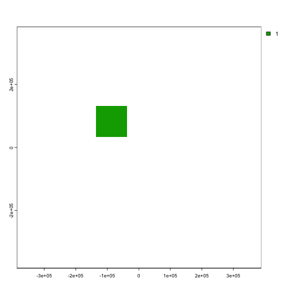
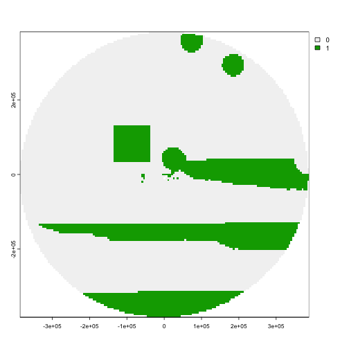
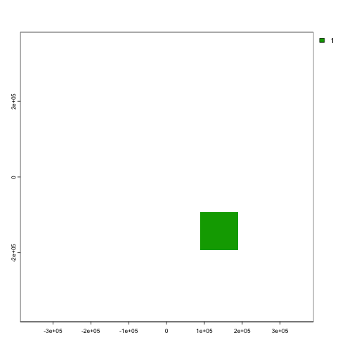
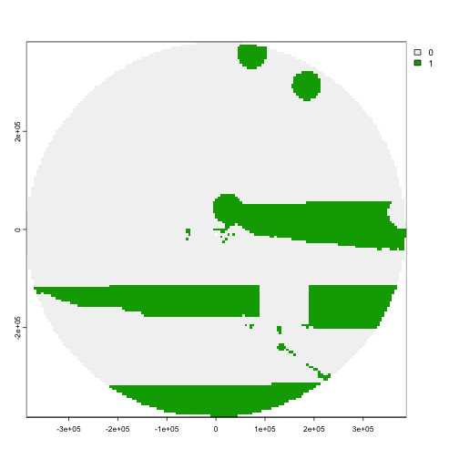
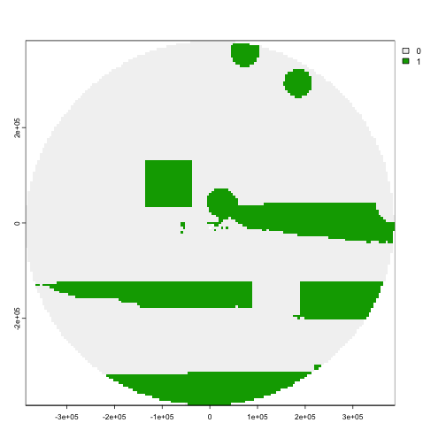
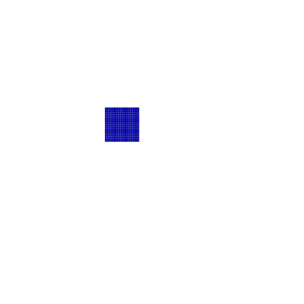
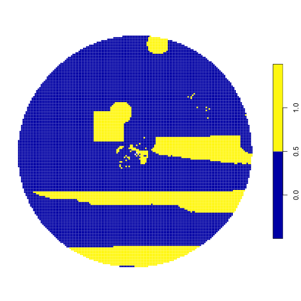
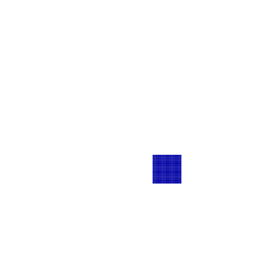
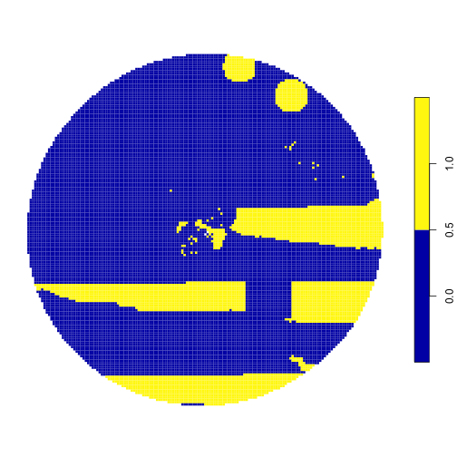
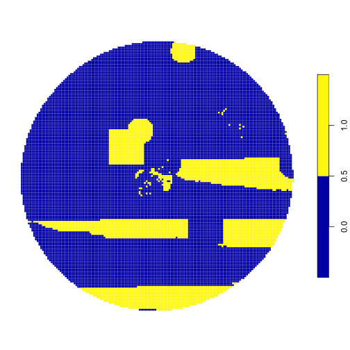

Prioritizations can be run using "locked-in" areas (areas that are already represented by existing protected areas) and "locked-out" areas (areas that are not available for protection). `patchwise` has the capability to include these areas while also creating the patches that should be protected as a single feature. For more information on locked-in and locked-out areas, refer to the [`prioritizr` documentation](https://prioritizr.net/).

A couple of things to note when using locked-in or locked-out areas with `patchwise`:

1. If there are several areas you wish to lock-in, combine them into a single layer. The same goes for locked-out layers.
2. When using `patchwise` you do not need to specify locked-in or locked-out constraints via the `prioritizr` `problem()` function. `patchwise` creates the locked-in and locked-out constraints within the `features_targets()` function so that the `problem()` finds a solution with 100% of the units in the locked-in area and 0% of the units in the locked-out area.

A quick note about `prioritizr` - sometimes there are several cells that are equally worthy of protection. In this case, there may be some discrepancy in the specific areas that are selected for protection depending on the input format of the data (`raster` vs `sf`). You'll notice that this is the case in our examples here. To get more consistent results, larger protective targets and/or more features should be added to the model.

For our examples, we use the prioritization optimizer `gurobi`, which can be found [here](https://www.gurobi.com/solutions/gurobi-optimizer/?campaignid=193283256&adgroupid=138872523240&creative=596136082788&keyword=gurobi%20optimization&matchtype=e&gclid=CjwKCAjwtuOlBhBREiwA7agf1oUW5qsO9aXGpfbjy04XRAw0DRpVGdSlrnEYRyC2q-B9EafXdArQUhoCDxQQAvD_BwE). Gurobi must be installed on your device and the `gurobi` R package must also be installed in R before you can run `prioritizr`.

# Implement locked-in areas using a `raster` input

To generate our data for this example, we will use data from Bermuda generated via `oceandatr`.


```r
# Load libraries
library(patchwise)

# Choose area of interest (Bermuda EEZ)
area <- oceandatr::get_area(area_name = "Bermuda",  mregions_column = "territory1")
projection <- '+proj=laea +lon_0=-64.8108333 +lat_0=32.3571917 +datum=WGS84 +units=m +no_defs'

# Create a planning grid
planning_rast <- spatialgridr::get_grid(area, projection = projection)

# Grab all relevant data
features_rast <- oceandatr::get_features(spatial_grid = planning_rast)

# Create a "cost" to protecting a cell - just a uniform cost for this example
cost_rast <- stats::setNames(planning_rast, "cost")

# Separate seamount data - we want to protect entire patches
seamounts_rast <- features_rast[["seamounts"]]
features_rast <- features_rast[[names(features_rast)[names(features_rast) != "seamounts"]]]
```

We can generate a locked-in layer that would represent an existing MPA.


```r
# Create a function to produce a square area
create_area <- function(spatial_grid, mpa_size, edge_offset) {
  if(class(spatial_grid)[1] %in% c("RasterLayer", "SpatRaster")) {
    terra::rast(spatial_grid,
                vals = c(rep(NA, (terra::ncol(spatial_grid)*edge_offset)),
                         rep(c(rep(NA, edge_offset),
                               rep(1, mpa_size),
                               rep(NA, (terra::ncol(spatial_grid)-(edge_offset+mpa_size)))),
                             mpa_size),
                         rep(NA, (terra::ncol(spatial_grid)*(terra::nrow(spatial_grid)-edge_offset-mpa_size)))))
  } else if(class(spatial_grid)[1] == "sf") {
    sf_to_grid <- sf::st_make_grid(spatial_grid, cellsize = sqrt(sf::st_area(spatial_grid[1,])))
    sf_centroid <- sf::st_centroid(sf_to_grid) %>%
      sf::st_coordinates(.) %>%
      as.data.frame() %>%
      dplyr::mutate(X = round(X, digits = 4),
                    Y = round(Y, digits = 4))

    # sf::st_make_grid changes the orientation of how cells are read - change them back
    sf_to_grid <- sf_to_grid %>%
      as.data.frame() %>%
      dplyr::bind_cols(sf_centroid) %>%
      dplyr::arrange(dplyr::desc(Y), X) %>%
      dplyr::select(-X, -Y)

    cols_sf_to_grid <- length(unique(sf_centroid$X))
    rows_sf_to_grid <- length(unique(sf_centroid$Y))

    sf_to_grid <- sf_to_grid %>%
      sf::st_sf() %>%
      dplyr::mutate(layer = c(rep(NA, (cols_sf_to_grid*edge_offset)),
                         rep(c(rep(NA, edge_offset),
                               rep(1, mpa_size),
                               rep(NA, (cols_sf_to_grid-(edge_offset+mpa_size)))),
                             mpa_size),
                         rep(NA, (cols_sf_to_grid*(rows_sf_to_grid-edge_offset-mpa_size)))))

    # the planning sf only includes polygons for the planning area (we need to remove them) so the number of cells matches the planning grid
    sf_to_grid <- sf_to_grid[sf_to_grid$geometry %in% spatial_grid[[1]], ]
    rownames(sf_to_grid) <- NULL
    sf_to_grid %>%
      dplyr::relocate(layer, 1)
    }
}
```


```r
# Create a fake MPA
mpa_location <- create_area(planning_rast, 20, 50)

# Plot fake MPA
terra::plot(mpa_location)
```



Now we can continue using `patchwise` to group seamount areas so that entire seamount ranges are protected (and not portions of seamounts).


```r
# Create seamount patches - seamount areas that touch are considered the same patch
patches_rast <- patchwise::create_patches(seamounts_rast)

# Create patches dataframe - this creates several constraints so that entire seamount units are protected together
patches_df_rast <- patchwise::create_patch_df(spatial_grid = planning_rast, features = features_rast, patches = patches_rast, costs = cost_rast, locked_in = mpa_location)
#> [1] "Processing patch 1 of 7"
#> [1] "Processing patch 2 of 7"
#> [1] "Processing patch 3 of 7"
#> [1] "Processing patch 4 of 7"
#> [1] "Processing patch 5 of 7"
#> [1] "Processing patch 6 of 7"
#> [1] "Processing patch 7 of 7"

# Create boundary matrix for prioritizr
boundary_matrix_rast <- patchwise::create_boundary_matrix(spatial_grid = planning_rast, patches = patches_rast, patch_df = patches_df_rast)

# Create targets for protection - let's just do 20% for each feature (including 20% of whole seamounts)
targets_rast <- patchwise::features_targets(targets = rep(0.2, (terra::nlyr(features_rast) + 1)), features = features_rast, pre_patches = seamounts_rast, locked_in = mpa_location)

# Add these targets to targets for protection for the "constraints" we introduced to protect entire seamount units
constraints_rast <- patchwise::constraints_targets(feature_targets = targets_rast, patch_df = patches_df_rast)

# Run the prioritization
problem_rast <- prioritizr::problem(x = patches_df_rast, features = constraints_rast$feature, cost_column = "cost") %>%
  prioritizr::add_min_set_objective() %>%
  prioritizr::add_manual_targets(constraints_rast) %>%
  prioritizr::add_binary_decisions() %>%
  prioritizr::add_boundary_penalties(penalty = 0.000002, data = boundary_matrix_rast) %>%
  prioritizr::add_gurobi_solver(gap = 0.1, threads = parallel::detectCores()-1)

# Solve the prioritization
solution_rast <- solve(problem_rast)
#> Gurobi Optimizer version 10.0.0 build v10.0.0rc2 (mac64[arm])
#> 
#> CPU model: Apple M1 Max
#> Thread count: 10 physical cores, 10 logical processors, using up to 9 threads
#> 
#> Optimize a model with 76296 rows, 56073 columns and 214386 nonzeros
#> Model fingerprint: 0xc25c3da2
#> Variable types: 0 continuous, 56073 integer (56073 binary)
#> Coefficient statistics:
#>   Matrix range     [1e+00, 5e+02]
#>   Objective range  [2e-02, 5e+02]
#>   Bounds range     [1e+00, 1e+00]
#>   RHS range        [1e+00, 4e+03]
#> Found heuristic solution: objective 3740.9750000
#> Presolve removed 2915 rows and 1615 columns
#> Presolve time: 0.63s
#> Presolved: 73381 rows, 54458 columns, 207121 nonzeros
#> Variable types: 0 continuous, 54458 integer (54458 binary)
#> Root relaxation presolved: 73381 rows, 54458 columns, 207121 nonzeros
#> 
#> Deterministic concurrent LP optimizer: primal and dual simplex
#> Showing first log only...
#> 
#> Warning: Markowitz tolerance tightened to 0.25
#> 
#> Root simplex log...
#> 
#> Iteration    Objective       Primal Inf.    Dual Inf.      Time
#>    75523    3.7292125e+03   0.000000e+00   4.676925e+03      5s
#>    88193    3.7247051e+03   0.000000e+00   1.152036e+03     10s
#>    92893    3.7233423e+03   0.000000e+00   4.043997e+04     15s
#>    97523    3.7230699e+03   0.000000e+00   1.977410e+03     20s
#>   103348    3.7230204e+03   0.000000e+00   5.256307e+04     25s
#>   109517    3.7228460e+03   0.000000e+00   2.017317e+04     30s
#>   113716    3.7228405e+03   0.000000e+00   5.063170e+02     35s
#>   117666    3.7228325e+03   0.000000e+00   8.510317e+02     40s
#>   120091    3.7228308e+03   0.000000e+00   1.106731e+03     45s
#>   122601    3.7228285e+03   0.000000e+00   1.936248e+03     50s
#> Concurrent spin time: 0.21s
#> 
#> Solved with dual simplex
#> 
#> Root simplex log...
#> 
#> Iteration    Objective       Primal Inf.    Dual Inf.      Time
#>    69647    3.7229317e+03   0.000000e+00   0.000000e+00     51s
#> 
#> Root relaxation: objective 3.722932e+03, 69647 iterations, 50.17 seconds (151.93 work units)
#> 
#>     Nodes    |    Current Node    |     Objective Bounds      |     Work
#>  Expl Unexpl |  Obj  Depth IntInf | Incumbent    BestBd   Gap | It/Node Time
#> 
#>      0     0 3722.93174    0 50601 3740.97500 3722.93174  0.48%     -   51s
#> 
#> Explored 1 nodes (69735 simplex iterations) in 51.23 seconds (153.73 work units)
#> Thread count was 9 (of 10 available processors)
#> 
#> Solution count 1: 3740.98 
#> 
#> Optimal solution found (tolerance 1.00e-01)
#> Best objective 3.740975000000e+03, best bound 3.722931735863e+03, gap 0.4823%

# Convert the prioritization into a more digestible format
result_rast <- patchwise::convert_solution(solution = solution_rast, patch_df = patches_df_rast, spatial_grid = planning_rast)

# Show the results
terra::plot(result_rast)
```



The areas in green are those selected by the prioritization for protection. We can clearly see the locked-in area (the green square) was included!

# Implement locked-out areas using a `raster` input

What if we want to note of an area that we cannot consider for protection? We can include a "locked-out" area. We repeat the example above, but this time we will exclude this area from the prioritization results.


```r
# Create a fake locked-out area
no_protection <- create_area(planning_rast, 20, 95)

# Plot fake locked-out area
terra::plot(no_protection)
```



Now we can continue using `patchwise` to group seamount areas so that entire seamount ranges are protected (and not portions of seamounts).


```r
# Create patches dataframe - this creates several constraints so that entire seamount units are protected together
patches_df_rast <- patchwise::create_patch_df(spatial_grid = planning_rast, features = features_rast, patches = patches_rast, costs = cost_rast, locked_out = no_protection)
#> [1] "Processing patch 1 of 7"
#> [1] "Processing patch 2 of 7"
#> [1] "Processing patch 3 of 7"
#> [1] "Processing patch 4 of 7"
#> [1] "Processing patch 5 of 7"
#> [1] "Processing patch 6 of 7"
#> [1] "Processing patch 7 of 7"

# Create boundary matrix for prioritizr
boundary_matrix_rast <- patchwise::create_boundary_matrix(spatial_grid = planning_rast, patches = patches_rast, patch_df = patches_df_rast)

# Create targets for protection - let's just do 20% for each feature (including 20% of whole seamounts)
targets_rast <- patchwise::features_targets(targets = rep(0.2, (terra::nlyr(features_rast) + 1)), features = features_rast, pre_patches = seamounts_rast, locked_out = no_protection)

# Add these targets to targets for protection for the "constraints" we introduced to protect entire seamount units
constraints_rast <- patchwise::constraints_targets(feature_targets = targets_rast, patch_df = patches_df_rast)

# Run the prioritization
problem_rast <- prioritizr::problem(x = patches_df_rast, features = constraints_rast$feature, cost_column = "cost") %>%
  prioritizr::add_min_set_objective() %>%
  prioritizr::add_manual_targets(constraints_rast) %>%
  prioritizr::add_binary_decisions() %>%
  prioritizr::add_boundary_penalties(penalty = 0.000002, data = boundary_matrix_rast) %>%
  prioritizr::add_gurobi_solver(gap = 0.1, threads = parallel::detectCores()-1)

# Solve the prioritization
solution_rast <- solve(problem_rast)
#> Gurobi Optimizer version 10.0.0 build v10.0.0rc2 (mac64[arm])
#> 
#> CPU model: Apple M1 Max
#> Thread count: 10 physical cores, 10 logical processors, using up to 9 threads
#> 
#> Optimize a model with 76296 rows, 56073 columns and 214385 nonzeros
#> Model fingerprint: 0xf7b92fc5
#> Variable types: 0 continuous, 56073 integer (56073 binary)
#> Coefficient statistics:
#>   Matrix range     [1e+00, 5e+02]
#>   Objective range  [2e-02, 5e+02]
#>   Bounds range     [1e+00, 1e+00]
#>   RHS range        [1e+00, 4e+03]
#> Found heuristic solution: objective 3733.8850000
#> Presolve removed 2633 rows and 1557 columns
#> Presolve time: 0.56s
#> Presolved: 73663 rows, 54516 columns, 207723 nonzeros
#> Variable types: 0 continuous, 54516 integer (54516 binary)
#> Root relaxation presolved: 73663 rows, 54516 columns, 207723 nonzeros
#> 
#> Deterministic concurrent LP optimizer: primal and dual simplex
#> Showing first log only...
#> 
#> Warning: Markowitz tolerance tightened to 0.5
#> 
#> Root simplex log...
#> 
#> Iteration    Objective       Primal Inf.    Dual Inf.      Time
#>    80813    3.7266671e+03   0.000000e+00   1.275446e+03      5s
#>    89493    3.7240545e+03   0.000000e+00   1.496065e+03     10s
#>    94833    3.7234491e+03   0.000000e+00   1.472206e+03     15s
#>    98708    3.7226503e+03   0.000000e+00   1.557963e+03     20s
#>   103183    3.7217673e+03   0.000000e+00   2.651195e+03     25s
#>   108113    3.7216433e+03   0.000000e+00   7.935639e+03     30s
#> Concurrent spin time: 0.00s
#> 
#> Solved with dual simplex
#> 
#> Root simplex log...
#> 
#> Iteration    Objective       Primal Inf.    Dual Inf.      Time
#>    55179    3.7213346e+03   0.000000e+00   0.000000e+00     35s
#> 
#> Root relaxation: objective 3.721335e+03, 55179 iterations, 34.36 seconds (101.60 work units)
#> 
#>     Nodes    |    Current Node    |     Objective Bounds      |     Work
#>  Expl Unexpl |  Obj  Depth IntInf | Incumbent    BestBd   Gap | It/Node Time
#> 
#>      0     0 3721.33461    0 49528 3733.88500 3721.33461  0.34%     -   35s
#> 
#> Explored 1 nodes (55285 simplex iterations) in 35.40 seconds (103.27 work units)
#> Thread count was 9 (of 10 available processors)
#> 
#> Solution count 1: 3733.89 
#> 
#> Optimal solution found (tolerance 1.00e-01)
#> Best objective 3.733885000000e+03, best bound 3.721335000000e+03, gap 0.3361%

# Convert the prioritization into a more digestible format
result_rast <- patchwise::convert_solution(solution = solution_rast, patch_df = patches_df_rast, spatial_grid = planning_rast)

# Show the results
terra::plot(result_rast)
```



Great! The area that we don't want to include in the solution is removed!

# Implement locked-in and locked-out areas using a `raster` input

We can also run a scenario in which we have both locked-in and locked-out areas.


```r
# Create patches dataframe - this creates several constraints so that entire seamount units are protected together
patches_df_rast <- patchwise::create_patch_df(spatial_grid = planning_rast, features = features_rast, patches = patches_rast, costs = cost_rast, locked_in = mpa_location, locked_out = no_protection)
#> [1] "Processing patch 1 of 7"
#> [1] "Processing patch 2 of 7"
#> [1] "Processing patch 3 of 7"
#> [1] "Processing patch 4 of 7"
#> [1] "Processing patch 5 of 7"
#> [1] "Processing patch 6 of 7"
#> [1] "Processing patch 7 of 7"

# Create boundary matrix for prioritizr
boundary_matrix_rast <- patchwise::create_boundary_matrix(spatial_grid = planning_rast, patches = patches_rast, patch_df = patches_df_rast)

# Create targets for protection - let's just do 20% for each feature (including 20% of whole seamounts)
targets_rast <- patchwise::features_targets(targets = rep(0.2, (terra::nlyr(features_rast) + 1)), features = features_rast, pre_patches = seamounts_rast, locked_in = mpa_location, locked_out = no_protection)

# Add these targets to targets for protection for the "constraints" we introduced to protect entire seamount units
constraints_rast <- patchwise::constraints_targets(feature_targets = targets_rast, patch_df = patches_df_rast)

# Run the prioritization
problem_rast <- prioritizr::problem(x = patches_df_rast, features = constraints_rast$feature, cost_column = "cost") %>%
  prioritizr::add_min_set_objective() %>%
  prioritizr::add_manual_targets(constraints_rast) %>%
  prioritizr::add_binary_decisions() %>%
  prioritizr::add_boundary_penalties(penalty = 0.000002, data = boundary_matrix_rast) %>%
  prioritizr::add_gurobi_solver(gap = 0.1, threads = parallel::detectCores()-1)

# Solve the prioritization
solution_rast <- solve(problem_rast)
#> Gurobi Optimizer version 10.0.0 build v10.0.0rc2 (mac64[arm])
#> 
#> CPU model: Apple M1 Max
#> Thread count: 10 physical cores, 10 logical processors, using up to 9 threads
#> 
#> Optimize a model with 76297 rows, 56073 columns and 214786 nonzeros
#> Model fingerprint: 0x8acc3e12
#> Variable types: 0 continuous, 56073 integer (56073 binary)
#> Coefficient statistics:
#>   Matrix range     [1e+00, 5e+02]
#>   Objective range  [2e-02, 5e+02]
#>   Bounds range     [1e+00, 1e+00]
#>   RHS range        [1e+00, 4e+03]
#> Found heuristic solution: objective 3741.0600000
#> Presolve removed 4596 rows and 2855 columns
#> Presolve time: 0.63s
#> Presolved: 71701 rows, 53218 columns, 202309 nonzeros
#> Variable types: 0 continuous, 53218 integer (53218 binary)
#> Root relaxation presolved: 71701 rows, 53218 columns, 202309 nonzeros
#> 
#> Deterministic concurrent LP optimizer: primal and dual simplex
#> Showing first log only...
#> 
#> Warning: Markowitz tolerance tightened to 0.5
#> 
#> Root simplex log...
#> 
#> Iteration    Objective       Primal Inf.    Dual Inf.      Time
#>    78109    3.7276375e+03   0.000000e+00   1.808055e+03      5s
#>    86897    3.7269661e+03   0.000000e+00   3.529364e+02     10s
#>    97481    3.7256248e+03   0.000000e+00   1.452423e+03     15s
#>   107426    3.7231009e+03   0.000000e+00   1.344078e+04     20s
#>   111947    3.7230528e+03   0.000000e+00   2.752187e+03     25s
#>   116500    3.7230355e+03   0.000000e+00   4.431877e+03     30s
#>   119976    3.7230221e+03   0.000000e+00   8.289934e+03     35s
#>   123672    3.7230017e+03   0.000000e+00   2.159264e+03     40s
#>   126286    3.7229920e+03   0.000000e+00   7.322767e+02     45s
#> Concurrent spin time: 0.00s
#> 
#> Solved with dual simplex
#> 
#> Root simplex log...
#> 
#> Iteration    Objective       Primal Inf.    Dual Inf.      Time
#>    64341    3.7230710e+03   0.000000e+00   0.000000e+00     49s
#> 
#> Root relaxation: objective 3.723071e+03, 64341 iterations, 48.36 seconds (144.87 work units)
#> 
#>     Nodes    |    Current Node    |     Objective Bounds      |     Work
#>  Expl Unexpl |  Obj  Depth IntInf | Incumbent    BestBd   Gap | It/Node Time
#> 
#>      0     0 3723.07098    0 49364 3741.06000 3723.07098  0.48%     -   49s
#> 
#> Explored 1 nodes (64433 simplex iterations) in 49.45 seconds (146.66 work units)
#> Thread count was 9 (of 10 available processors)
#> 
#> Solution count 1: 3741.06 
#> 
#> Optimal solution found (tolerance 1.00e-01)
#> Best objective 3.741060000000e+03, best bound 3.723070980814e+03, gap 0.4809%

# Convert the prioritization into a more digestible format
result_rast <- patchwise::convert_solution(solution = solution_rast, patch_df = patches_df_rast, spatial_grid = planning_rast)

# Show the results
terra::plot(result_rast)
```



It looks like we got the results we wanted - the locked-in areas were included in the prioritization output as an area to protect, and the locked-out areas were not included!

# Implement locked-in areas using an `sf` input

To generate our data for this example, we will use data from Bermuda generated via `oceandatr`.


We can generate a locked-in layer that would represent an existing MPA.


```r
# Create a fake MPA
mpa_location <- create_area(planning_sf, 20, 50)

# Plot fake MPA
plot(mpa_location, main = NULL, border = F)
```



Now we can continue using `patchwise` to group seamount areas so that entire seamount ranges are protected (and not portions of seamounts).


```r
# Create seamount patches - seamount areas that touch are considered the same patch
patches_sf <- patchwise::create_patches(seamounts_sf, spatial_grid = planning_sf)

# Create patches dataframe - this creates several constraints so that entire seamount units are protected together
patches_df_sf <- patchwise::create_patch_df(spatial_grid = planning_sf, features = features_sf, patches = patches_sf, costs = cost_sf, locked_in = mpa_location)
#> [1] "Processing patch 1 of 7"
#> [1] "Processing patch 2 of 7"
#> [1] "Processing patch 3 of 7"
#> [1] "Processing patch 4 of 7"
#> [1] "Processing patch 5 of 7"
#> [1] "Processing patch 6 of 7"
#> [1] "Processing patch 7 of 7"

# Create boundary matrix for prioritizr
boundary_matrix_sf <- patchwise::create_boundary_matrix(spatial_grid = planning_sf, patches = patches_sf, patch_df = patches_df_sf)

# Create targets for protection - let's just do 20% for each feature (including 20% of whole seamounts)
targets_sf <- patchwise::features_targets(targets = rep(0.2, ncol(features_sf)), features = features_sf, pre_patches = seamounts_sf, locked_in = mpa_location)

# Add these targets to targets for protection for the "constraints" we introduced to protect entire seamount units
constraints_sf <- patchwise::constraints_targets(feature_targets = targets_sf, patch_df = patches_df_sf)

# Run the prioritization
problem_sf <- prioritizr::problem(x = patches_df_sf, features = constraints_sf$feature, cost_column = "cost") %>%
  prioritizr::add_min_set_objective() %>%
  prioritizr::add_manual_targets(constraints_sf) %>%
  prioritizr::add_binary_decisions() %>%
  prioritizr::add_boundary_penalties(penalty = 0.000002, data = boundary_matrix_sf) %>%
  prioritizr::add_gurobi_solver(gap = 0.1, threads = parallel::detectCores()-1)

# Solve the prioritization
solution_sf <- solve(problem_sf)
#> Gurobi Optimizer version 10.0.0 build v10.0.0rc2 (mac64[arm])
#> 
#> CPU model: Apple M1 Max
#> Thread count: 10 physical cores, 10 logical processors, using up to 9 threads
#> 
#> Optimize a model with 76981 rows, 56170 columns and 218036 nonzeros
#> Model fingerprint: 0xfea2ae20
#> Variable types: 0 continuous, 56170 integer (56170 binary)
#> Coefficient statistics:
#>   Matrix range     [1e+00, 6e+02]
#>   Objective range  [2e-02, 6e+02]
#>   Bounds range     [1e+00, 1e+00]
#>   RHS range        [1e+00, 4e+03]
#> Found heuristic solution: objective 3732.8950000
#> Presolve removed 2637 rows and 1617 columns
#> Presolve time: 0.85s
#> Presolved: 74344 rows, 54553 columns, 211669 nonzeros
#> Variable types: 0 continuous, 54553 integer (54553 binary)
#> Found heuristic solution: objective 3732.8900000
#> Root relaxation presolve removed 334 rows and 0 columns
#> Root relaxation presolved: 74010 rows, 54553 columns, 210667 nonzeros
#> 
#> Deterministic concurrent LP optimizer: primal and dual simplex
#> Showing first log only...
#> 
#> Warning: Markowitz tolerance tightened to 0.25
#> 
#> Root simplex log...
#> 
#> Iteration    Objective       Primal Inf.    Dual Inf.      Time
#>    73906    3.7232193e+03   0.000000e+00   2.534610e+03      5s
#>    84130    3.7226720e+03   0.000000e+00   1.378961e+04     10s
#>    91314    3.7213965e+03   0.000000e+00   5.732673e+03     15s
#>    96380    3.7208580e+03   0.000000e+00   9.779234e+02     20s
#>   101294    3.7206395e+03   0.000000e+00   1.848140e+03     25s
#>   107290    3.7200282e+03   0.000000e+00   1.169641e+03     30s
#>   113612    3.7199862e+03   0.000000e+00   2.998862e+03     35s
#>   117346    3.7199740e+03   0.000000e+00   3.094314e+04     40s
#>   120256    3.7199589e+03   0.000000e+00   6.978084e+02     45s
#> Concurrent spin time: 0.00s
#> 
#> Solved with dual simplex
#> 
#> Root simplex log...
#> 
#> Iteration    Objective       Primal Inf.    Dual Inf.      Time
#>    58008    3.7200450e+03   0.000000e+00   0.000000e+00     50s
#> 
#> Root relaxation: objective 3.720045e+03, 58008 iterations, 49.04 seconds (144.48 work units)
#> 
#>     Nodes    |    Current Node    |     Objective Bounds      |     Work
#>  Expl Unexpl |  Obj  Depth IntInf | Incumbent    BestBd   Gap | It/Node Time
#> 
#>      0     0 3720.04500    0 50171 3732.89000 3720.04500  0.34%     -   50s
#> 
#> Explored 1 nodes (58105 simplex iterations) in 50.33 seconds (146.73 work units)
#> Thread count was 9 (of 10 available processors)
#> 
#> Solution count 2: 3732.89 3732.9 
#> 
#> Optimal solution found (tolerance 1.00e-01)
#> Best objective 3.732890000000e+03, best bound 3.720045002821e+03, gap 0.3441%

# Convert the prioritization into a more digestible format
result_sf <- patchwise::convert_solution(solution = solution_sf, patch_df = patches_df_sf, spatial_grid = planning_sf)

# Show the results
plot(result_sf, main = NULL, border = F)
```



The areas in yellow are those selected by the prioritization for protection. We can clearly see the locked-in area (the yellow square) was included!


# Implement locked-out areas using an `sf` input

What if we want to note of an area that we cannot consider for protection? We can include a "locked-out" area. We repeat the example above, but this time we will exclude this area from the prioritization results.


```r
# Create a fake locked-out area
no_protection <- create_area(planning_sf, 20, 95)

# Plot fake locked-out area
plot(no_protection, main = NULL, border = F)
```



Now we can continue using `patchwise` to group seamount areas so that entire seamount ranges are protected (and not portions of seamounts).


```r
# Create patches dataframe - this creates several constraints so that entire seamount units are protected together
patches_df_sf <- patchwise::create_patch_df(spatial_grid = planning_sf, features = features_sf, patches = patches_sf, costs = cost_sf, locked_out = no_protection)
#> [1] "Processing patch 1 of 7"
#> [1] "Processing patch 2 of 7"
#> [1] "Processing patch 3 of 7"
#> [1] "Processing patch 4 of 7"
#> [1] "Processing patch 5 of 7"
#> [1] "Processing patch 6 of 7"
#> [1] "Processing patch 7 of 7"

# Create boundary matrix for prioritizr
boundary_matrix_sf <- patchwise::create_boundary_matrix(spatial_grid = planning_sf, patches = patches_sf, patch_df = patches_df_sf)

# Create targets for protection - let's just do 20% for each feature (including 20% of whole seamounts)
targets_sf <- patchwise::features_targets(targets = rep(0.2, ncol(features_sf)), features = features_sf, pre_patches = seamounts_sf, locked_out = no_protection)

# Add these targets to targets for protection for the "constraints" we introduced to protect entire seamount units
constraints_sf <- patchwise::constraints_targets(feature_targets = targets_sf, patch_df = patches_df_sf)

# Run the prioritization
problem_sf <- prioritizr::problem(x = patches_df_sf, features = constraints_sf$feature, cost_column = "cost") %>%
  prioritizr::add_min_set_objective() %>%
  prioritizr::add_manual_targets(constraints_sf) %>%
  prioritizr::add_binary_decisions() %>%
  prioritizr::add_boundary_penalties(penalty = 0.000002, data = boundary_matrix_sf) %>%
  prioritizr::add_gurobi_solver(gap = 0.1, threads = parallel::detectCores()-1)

# Solve the prioritization
solution_sf <- solve(problem_sf)
#> Gurobi Optimizer version 10.0.0 build v10.0.0rc2 (mac64[arm])
#> 
#> CPU model: Apple M1 Max
#> Thread count: 10 physical cores, 10 logical processors, using up to 9 threads
#> 
#> Optimize a model with 76981 rows, 56170 columns and 218035 nonzeros
#> Model fingerprint: 0x908efcd6
#> Variable types: 0 continuous, 56170 integer (56170 binary)
#> Coefficient statistics:
#>   Matrix range     [1e+00, 6e+02]
#>   Objective range  [2e-02, 6e+02]
#>   Bounds range     [1e+00, 1e+00]
#>   RHS range        [1e+00, 4e+03]
#> Found heuristic solution: objective 3732.8450000
#> Presolve removed 2781 rows and 1608 columns
#> Presolve time: 0.65s
#> Presolved: 74200 rows, 54562 columns, 211019 nonzeros
#> Variable types: 0 continuous, 54562 integer (54562 binary)
#> Root relaxation presolved: 74200 rows, 54562 columns, 211019 nonzeros
#> 
#> Deterministic concurrent LP optimizer: primal and dual simplex
#> Showing first log only...
#> 
#> Warning: Markowitz tolerance tightened to 0.5
#> 
#> Root simplex log...
#> 
#> Iteration    Objective       Primal Inf.    Dual Inf.      Time
#>    79902    3.7235278e+03   0.000000e+00   1.105348e+03      5s
#>    88841    3.7209518e+03   0.000000e+00   3.043537e+03     10s
#>    93297    3.7199971e+03   0.000000e+00   3.033930e+03     15s
#>    97387    3.7198828e+03   0.000000e+00   1.960177e+03     20s
#>   101633    3.7198377e+03   0.000000e+00   1.484675e+04     25s
#>   105525    3.7198302e+03   0.000000e+00   2.847074e+04     30s
#> Concurrent spin time: 1.55s
#> 
#> Solved with dual simplex
#> 
#> Root simplex log...
#> 
#> Iteration    Objective       Primal Inf.    Dual Inf.      Time
#>    41579    3.7198669e+03   0.000000e+00   0.000000e+00     32s
#> 
#> Root relaxation: objective 3.719867e+03, 41579 iterations, 30.89 seconds (90.95 work units)
#> 
#>     Nodes    |    Current Node    |     Objective Bounds      |     Work
#>  Expl Unexpl |  Obj  Depth IntInf | Incumbent    BestBd   Gap | It/Node Time
#> 
#>      0     0 3719.86693    0 49565 3732.84500 3719.86693  0.35%     -   31s
#> 
#> Explored 1 nodes (41687 simplex iterations) in 31.99 seconds (92.79 work units)
#> Thread count was 9 (of 10 available processors)
#> 
#> Solution count 1: 3732.85 
#> 
#> Optimal solution found (tolerance 1.00e-01)
#> Best objective 3.732845000000e+03, best bound 3.719866927108e+03, gap 0.3477%

# Convert the prioritization into a more digestible format
result_sf <- patchwise::convert_solution(solution = solution_sf, patch_df = patches_df_sf, spatial_grid = planning_sf)

# Show the results
plot(result_sf, main = NULL, border = F)
```


Great! The area that we don't want to include in the solution is removed!

# Implement locked-in and locked-out areas using an `sf` input

We can also run a scenario in which we have both locked-in and locked-out areas.


```r
# Create patches dataframe - this creates several constraints so that entire seamount units are protected together
patches_df_sf <- patchwise::create_patch_df(spatial_grid = planning_sf, features = features_sf, patches = patches_sf, costs = cost_sf, locked_in = mpa_location, locked_out = no_protection)
#> [1] "Processing patch 1 of 7"
#> [1] "Processing patch 2 of 7"
#> [1] "Processing patch 3 of 7"
#> [1] "Processing patch 4 of 7"
#> [1] "Processing patch 5 of 7"
#> [1] "Processing patch 6 of 7"
#> [1] "Processing patch 7 of 7"

# Create boundary matrix for prioritizr
boundary_matrix_sf <- patchwise::create_boundary_matrix(spatial_grid = planning_sf, patches = patches_sf, patch_df = patches_df_sf)

# Create targets for protection - let's just do 20% for each feature (including 20% of whole seamounts)
targets_sf <- patchwise::features_targets(targets = rep(0.2, ncol(features_sf)), features = features_sf, pre_patches = seamounts_sf, locked_in = mpa_location, locked_out = no_protection)

# Add these targets to targets for protection for the "constraints" we introduced to protect entire seamount units
constraints_sf <- patchwise::constraints_targets(feature_targets = targets_sf, patch_df = patches_df_sf)

# Run the prioritization
problem_sf <- prioritizr::problem(x = patches_df_sf, features = constraints_sf$feature, cost_column = "cost") %>%
  prioritizr::add_min_set_objective() %>%
  prioritizr::add_manual_targets(constraints_sf) %>%
  prioritizr::add_binary_decisions() %>%
  prioritizr::add_boundary_penalties(penalty = 0.000002, data = boundary_matrix_sf) %>%
  prioritizr::add_gurobi_solver(gap = 0.1, threads = parallel::detectCores()-1)

# Solve the prioritization
solution_sf <- solve(problem_sf)
#> Gurobi Optimizer version 10.0.0 build v10.0.0rc2 (mac64[arm])
#> 
#> CPU model: Apple M1 Max
#> Thread count: 10 physical cores, 10 logical processors, using up to 9 threads
#> 
#> Optimize a model with 76982 rows, 56170 columns and 218436 nonzeros
#> Model fingerprint: 0xf4048946
#> Variable types: 0 continuous, 56170 integer (56170 binary)
#> Coefficient statistics:
#>   Matrix range     [1e+00, 6e+02]
#>   Objective range  [2e-02, 6e+02]
#>   Bounds range     [1e+00, 1e+00]
#>   RHS range        [1e+00, 4e+03]
#> Found heuristic solution: objective 3732.9700000
#> Presolve removed 4318 rows and 2857 columns
#> Presolve time: 0.83s
#> Presolved: 72664 rows, 53313 columns, 206757 nonzeros
#> Variable types: 0 continuous, 53313 integer (53313 binary)
#> Found heuristic solution: objective 3732.9650000
#> Root relaxation presolve removed 334 rows and 0 columns
#> Root relaxation presolved: 72330 rows, 53313 columns, 205755 nonzeros
#> 
#> Deterministic concurrent LP optimizer: primal and dual simplex
#> Showing first log only...
#> 
#> Warning: Markowitz tolerance tightened to 0.25
#> 
#> Root simplex log...
#> 
#> Iteration    Objective       Primal Inf.    Dual Inf.      Time
#>    73407    3.7242230e+03   0.000000e+00   2.207557e+03      5s
#>    82887    3.7230283e+03   0.000000e+00   1.081976e+03     10s
#>    94453    3.7219914e+03   0.000000e+00   8.368012e+04     15s
#>   104318    3.7210228e+03   0.000000e+00   2.816210e+04     20s
#>   108720    3.7204223e+03   0.000000e+00   8.221710e+03     25s
#>   113456    3.7203600e+03   0.000000e+00   1.704823e+04     30s
#>   119904    3.7201420e+03   0.000000e+00   1.317371e+04     35s
#>   125883    3.7201043e+03   0.000000e+00   2.361554e+03     40s
#>   128253    3.7200995e+03   0.000000e+00   1.188923e+03     45s
#>   130553    3.7200964e+03   0.000000e+00   7.353355e+02     50s
#> Concurrent spin time: 1.65s
#> 
#> Solved with dual simplex
#> 
#> Root simplex log...
#> 
#> Iteration    Objective       Primal Inf.    Dual Inf.      Time
#>    60783    3.7201850e+03   0.000000e+00   0.000000e+00     51s
#> 
#> Root relaxation: objective 3.720185e+03, 60783 iterations, 49.62 seconds (137.67 work units)
#> 
#>     Nodes    |    Current Node    |     Objective Bounds      |     Work
#>  Expl Unexpl |  Obj  Depth IntInf | Incumbent    BestBd   Gap | It/Node Time
#> 
#>      0     0 3720.18505    0 48931 3732.96500 3720.18505  0.34%     -   50s
#> 
#> Explored 1 nodes (60901 simplex iterations) in 50.87 seconds (139.89 work units)
#> Thread count was 9 (of 10 available processors)
#> 
#> Solution count 2: 3732.97 3732.97 
#> 
#> Optimal solution found (tolerance 1.00e-01)
#> Best objective 3.732965000000e+03, best bound 3.720185046242e+03, gap 0.3424%

# Convert the prioritization into a more digestible format
result_sf <- patchwise::convert_solution(solution = solution_sf, patch_df = patches_df_sf, spatial_grid = planning_sf)

# Show the results
plot(result_sf, main = NULL, border = F)
```



It looks like we got the results we wanted - the locked-in areas were included in the prioritization output as an area to protect, and the locked-out areas were not included!
