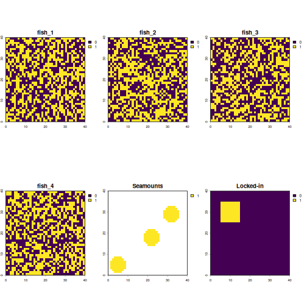
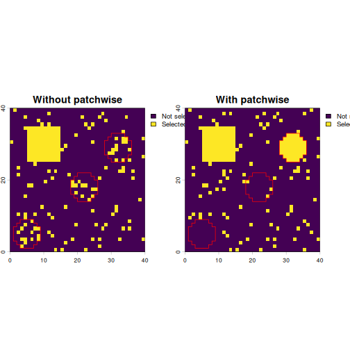
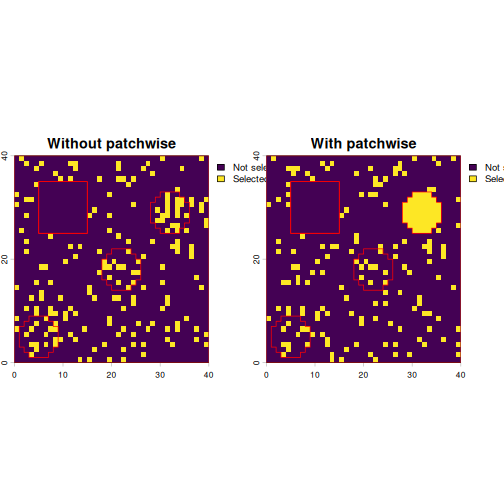
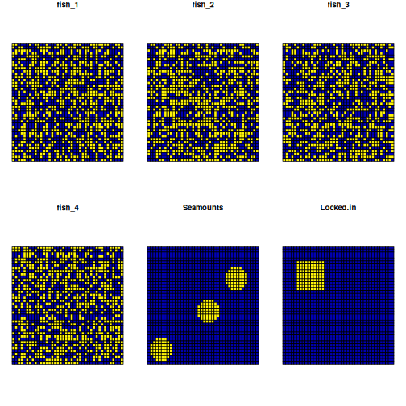
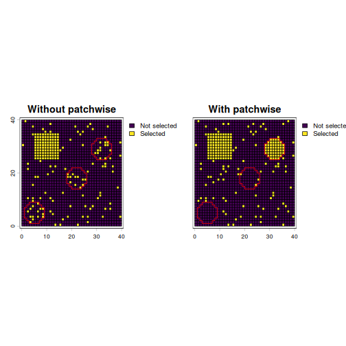
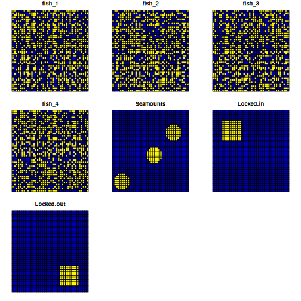
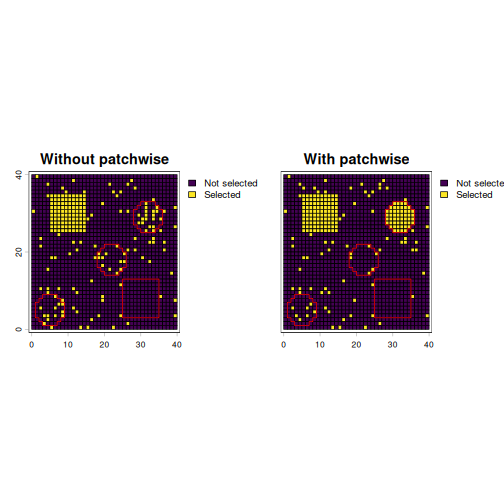

Prioritizations can be run using "locked-in" areas (areas that are already represented by existing protected areas) and "locked-out" areas (areas that are not available for protection). `patchwise` has the capability to include these areas while also creating the patches that should be protected as a single feature. For more information on locked-in and locked-out areas, refer to the [`prioritizr` documentation](https://prioritizr.net/).

A couple of things to note when using locked-in or locked-out areas with `patchwise`:

1. If there are several areas you wish to lock-in, combine them into a single layer. The same goes for locked-out layers.
2. When using `patchwise` you do not need to specify locked-in or locked-out constraints via the `prioritizr` `problem()` function. `patchwise` creates the locked-in and locked-out constraints within the `features_targets()` function so that the `problem()` finds a solution with 100% of the units in the locked-in area and 0% of the units in the locked-out area.

A quick note about `prioritizr` - sometimes there are several cells that are equally worthy of protection. In this case, there may be some discrepancy in the specific areas that are selected for protection depending on the input format of the data (`raster` vs `sf`). You'll notice that this is the case in our examples here. To get more consistent results, larger protective targets and/or more features should be added to the model.

# Implement locked-in areas using a `raster` input

To generate our data for this example, we will use data from Bermuda generated via `oceandatr`.


``` r
# Load libraries
library(patchwise)
library(terra)
library(sf)
library(prioritizr)
```

We will import some basic planning data, same as in the `patchwise` readme. For this example we will use a a 40 x 40 raster planning grid which has a cost value of 1 for each cell, and the following features that will be targeted in the prioritization:

- 4 random, binary (0 or 1) data layers, representing species distributions; for this example we are calling them fish
- 3 "patches" of contiguous features; for this example we are calling them seamounts


``` r
#import planning units/ cost raster
pu_raster <- rast(system.file("extdata/pu_raster.tif", package = "patchwise"))

#import fish distributions
fish_distributions <- rast(system.file("extdata/spp_distributions.tif", package = "patchwise"))

#import seamounts
seamounts <- rast(system.file("extdata/seamounts.tif", package = "patchwise"))
```

We will generate a square within our planning area that will be used as our locked in area


``` r
locked_area <- as.polygons(ext(5, 15, 25, 35)) |>
  rasterize(pu_raster, background = 0) |>
  setNames("Locked-in")
```

Let's look at our fish distributions, seamounts and locked-in area:


``` r
plot(c(fish_distributions, seamounts, locked_area))
```




Now we can continue using `patchwise` to group seamount areas so that entire seamount ranges are protected (and not portions of seamounts) - this is the same process as shown in the main `patchwise` readme, but with the locked-in area.


``` r
# Create seamount patches
patches_rast <- create_patches(seamounts)

# Create patches dataframe - this creates constraints so that entire seamount patches are protected
patches_df_rast <- create_patch_df(spatial_grid = pu_raster, features = fish_distributions, patches = patches_rast, costs = pu_raster, locked_in = locked_area)

# Create targets for protection - 20% for each feature (including 20% of whole seamounts)
targets_rast <- features_targets(targets = rep(0.2, (nlyr(fish_distributions) + 1)), features = fish_distributions, pre_patches = seamounts, locked_in = locked_area)

# Add these targets to targets for protection for the "constraints" we introduced to protect entire seamount patches
constraints_rast <- constraints_targets(feature_targets = targets_rast, patch_df = patches_df_rast)
```

With all the data preparation now done, we can run a prioritization using `prioritizr`:


For comparison, we will run a prioritization without using `patchwise`


We can now plot the solutions, and overlaying the outlines of the seamounts (in red), we can see that one entire seamount is included in the solution that used `patchwise`, whereas the solution without `patchwise` selects a few planning units in each seamount. Note that in the solution with `patchwise`, planning units that overlap seamounts that are not entirely selected have also been selected to meet targets for other features (fish distributions). The square, locked-in area is included in both scenarios.


``` r
plot(c(solution_no_patches, sol_rast_patches),
     fun = function()lines(as.polygons(seamounts), col = "red"),
     plg = list(legend = c("Not selected", "Selected")))
```



# Implement locked-out areas using a `raster` input

What if we want to note of an area that we cannot consider for protection? We can include a "locked-out" area. We repeat the example above, but this time we will exclude the "locked_area" from the prioritization results.


We can now plot the solutions, and overlaying the outlines of the seamounts and locked-out area (in red), we can see that one entire seamount is included in the solution that used `patchwise`, whereas the solution without `patchwise` selects a few planning units in each seamount. Note that in the solution with `patchwise`, planning units that overlap seamounts that are not entirely selected have also been selected to meet targets for other features (fish distributions). The square, locked-out area (red outline) is excluded in both scenarios.


``` r
plot(c(solution_no_patches, sol_rast_patches),
     fun = function()lines(rbind(as.polygons(seamounts), as.polygons(locked_area)), col = "red"),
     plg = list(legend = c("Not selected", "Selected")))
```



# Implement locked-in areas using an `sf` input

We can repeat the examples using `sf` input data rather than raster. First we polygonize the raster inputs


``` r
#create the planning grid, which is also the same as the cost grid since we are using planning units all with cost = 1
pu_sf <- as.polygons(pu_raster, aggregate = FALSE) |>
  st_as_sf()

features_sf <- as.polygons(fish_distributions, aggregate = FALSE) |>
  st_as_sf()

seamounts_sf <- as.polygons(seamounts, aggregate = FALSE, na.rm = FALSE) |>
  st_as_sf()

#replace NAs with zeroes
seamounts_sf[is.na(seamounts_sf$Seamounts), "Seamounts"] <- 0

locked_area_sf <- as.polygons(locked_area, aggregate = FALSE) |>
  st_as_sf()
```

Let's check our features, seamounts and locked-in area look ok:


``` r
plot(cbind(features_sf, st_drop_geometry(seamounts_sf), st_drop_geometry(locked_area_sf)))
```



Now we can go through the same process of data prepration using `patchwise`, then runnning a prioritization using `prioritizr`


``` r
# Create seamount patches
patches_sf <- create_patches(seamounts_sf, spatial_grid = pu_sf)

# Create patches dataframe - this creates constraints so that entire seamount patches are protected
patches_df_sf <- create_patch_df(spatial_grid = pu_sf, features = features_sf, patches = patches_sf, costs = pu_sf, locked_in = locked_area_sf)

# Create targets for protection - 20% for each feature (including 20% of whole seamounts)
targets_sf <- features_targets(targets = rep(0.2, ncol(features_sf)), features = features_sf, pre_patches = seamounts_sf, locked_in = locked_area_sf)

# Add these targets to targets for protection for the "constraints" we introduced to protect entire seamount patches
constraints_sf <- constraints_targets(feature_targets = targets_sf, patch_df = patches_df_sf)

# Create the prioritization problem
problem_patches_sf <- problem(x = patches_df_sf, features = constraints_sf$feature, cost_column = "cost") |>
  add_min_set_objective() |>
  add_manual_targets(constraints_sf) |>
  add_binary_decisions() |>
  add_default_solver()

# Solve the prioritization
solution_patches_sf_tbl <- solve(problem_patches_sf)
#> Set parameter Username
#> Set parameter LicenseID to value 2865081
#> Set parameter TimeLimit to value 2147483647
#> Set parameter MIPGap to value 0.1
#> Set parameter Presolve to value 2
#> Set parameter Threads to value 1
#> Academic license - for non-commercial use only - expires 2027-09-17
#> Gurobi Optimizer version 13.0.3 build v13.0.3rc0 (linux64 - "Linux Mint 22.3")
#> 
#> CPU model: Intel(R) Core(TM) i7-8700T CPU @ 2.40GHz, instruction set [SSE2|AVX|AVX2]
#> Thread count: 6 physical cores, 12 logical processors, using up to 1 threads
#> 
#> Non-default parameters:
#> TimeLimit  2147483647
#> MIPGap  0.1
#> Presolve  2
#> Threads  1
#> 
#> Optimize a model with 162 rows, 1603 columns and 3551 nonzeros (Min)
#> Model fingerprint: 0x87bff6b1
#> Model has 1603 linear objective coefficients
#> Variable types: 0 continuous, 1603 integer (1603 binary)
#> Coefficient statistics:
#>   Matrix range     [1e+00, 5e+01]
#>   Objective range  [1e+00, 5e+01]
#>   Bounds range     [1e+00, 1e+00]
#>   RHS range        [1e+00, 2e+02]
#> 
#> Found heuristic solution: objective 297.0000000
#> Presolve removed 10 rows and 1438 columns
#> Presolve time: 0.00s
#> Presolved: 152 rows, 165 columns, 646 nonzeros
#> Variable types: 0 continuous, 165 integer (150 binary)
#> Root relaxation presolved: 152 rows, 165 columns, 646 nonzeros
#> 
#> 
#> Root relaxation: objective 2.302000e+02, 83 iterations, 0.00 seconds (0.00 work units)
#> 
#>     Nodes    |    Current Node    |     Objective Bounds      |     Work
#>  Expl Unexpl |  Obj  Depth IntInf | Incumbent    BestBd   Gap | It/Node Time
#> 
#>      0     0  230.20000    0   14  297.00000  230.20000  22.5%     -    0s
#> H    0     0                     239.0000000  230.20000  3.68%     -    0s
#> 
#> Explored 1 nodes (86 simplex iterations) in 0.01 seconds (0.01 work units)
#> Thread count was 1 (of 12 available processors)
#> 
#> Solution count 2: 239 297 
#> 
#> Optimal solution found (tolerance 1.00e-01)
#> Best objective 2.390000000000e+02, best bound 2.310000000000e+02, gap 3.3473%

# Convert the solution into an sf object using the patchwise function `convert_solution()`
solution_sf_patches <- convert_solution(solution = solution_patches_sf_tbl, patch_df = patches_df_sf, spatial_grid = pu_sf)
```

For comparison, we will run a prioritization without using `patchwise`


We can now plot the solutions, and overlaying the outlines of the seamounts (in red), we can see that one entire seamount is included in the solution that used `patchwise`, whereas the solution without `patchwise` selects a few planning units in each seamount. Note that in the solution with `patchwise`, planning units that overlap seamounts that are not entirely selected have also been selected to meet targets for other features (fish distributions). The locked-in area is included in both solutions.


``` r
cbind(solution_no_patches_sf[,"solution_1"], st_drop_geometry(solution_sf_patches[, "protected"])) |>
  setNames(c("Without patchwise", "With patchwise", "geometry")) |>
  vect() |>
  plot(1:2,
       type = "interval",
       plg = list(legend = c("Not selected", "Selected")),
       fun = function()lines(as.polygons(seamounts, aggregate = TRUE), col = "red"))
```



# Implement locked-in and locked-out areas using an `sf` input

As a final example we will include both a locked-in and a locked-out area. We will use the same data as before, but create a new square area for the locked-out area.


``` r
locked_out_area <- as.polygons(ext(25, 35, 3, 13)) |>
  rasterize(pu_raster, background = 0) |>
  setNames("Locked-out") |>
  as.polygons(aggregate = FALSE) |>
  st_as_sf()
```

Plot our data


``` r
plot(cbind(features_sf, st_drop_geometry(seamounts_sf), st_drop_geometry(locked_area_sf), st_drop_geometry(locked_out_area)))
```




``` r
# Create patches dataframe - this creates constraints so that entire seamount patches are protected
patches_df_sf <- create_patch_df(spatial_grid = pu_sf, features = features_sf, patches = patches_sf, costs = pu_sf, locked_in = locked_area_sf, locked_out = locked_out_area)

# Create targets for protection - 20% for each feature (including 20% of whole seamounts)
targets_sf <- features_targets(targets = rep(0.2, ncol(features_sf)), features = features_sf, pre_patches = seamounts_sf, locked_in = locked_area_sf, locked_out = locked_out_area)

# Add these targets to targets for protection for the "constraints" we introduced to protect entire seamount patches
constraints_sf <- constraints_targets(feature_targets = targets_sf, patch_df = patches_df_sf)

# Create the prioritization problem
problem_patches_sf <- problem(x = patches_df_sf, features = constraints_sf$feature, cost_column = "cost") |>
  add_min_set_objective() |>
  add_manual_targets(constraints_sf) |>
  add_binary_decisions() |>
  add_default_solver()

# Solve the prioritization
solution_patches_sf_tbl <- solve(problem_patches_sf)
#> Set parameter Username
#> Set parameter LicenseID to value 2865081
#> Set parameter TimeLimit to value 2147483647
#> Set parameter MIPGap to value 0.1
#> Set parameter Presolve to value 2
#> Set parameter Threads to value 1
#> Academic license - for non-commercial use only - expires 2027-09-17
#> Gurobi Optimizer version 13.0.3 build v13.0.3rc0 (linux64 - "Linux Mint 22.3")
#> 
#> CPU model: Intel(R) Core(TM) i7-8700T CPU @ 2.40GHz, instruction set [SSE2|AVX|AVX2]
#> Thread count: 6 physical cores, 12 logical processors, using up to 1 threads
#> 
#> Non-default parameters:
#> TimeLimit  2147483647
#> MIPGap  0.1
#> Presolve  2
#> Threads  1
#> 
#> Optimize a model with 163 rows, 1603 columns and 3651 nonzeros (Min)
#> Model fingerprint: 0x242e4b84
#> Model has 1603 linear objective coefficients
#> Variable types: 0 continuous, 1603 integer (1603 binary)
#> Coefficient statistics:
#>   Matrix range     [1e+00, 5e+01]
#>   Objective range  [1e+00, 5e+01]
#>   Bounds range     [1e+00, 1e+00]
#>   RHS range        [1e+00, 2e+02]
#> 
#> Found heuristic solution: objective 297.0000000
#> Presolve removed 11 rows and 1438 columns
#> Presolve time: 0.00s
#> Presolved: 152 rows, 165 columns, 646 nonzeros
#> Variable types: 0 continuous, 165 integer (150 binary)
#> Root relaxation presolved: 152 rows, 165 columns, 646 nonzeros
#> 
#> 
#> Root relaxation: objective 2.313333e+02, 65 iterations, 0.00 seconds (0.00 work units)
#> 
#>     Nodes    |    Current Node    |     Objective Bounds      |     Work
#>  Expl Unexpl |  Obj  Depth IntInf | Incumbent    BestBd   Gap | It/Node Time
#> 
#>      0     0  231.33333    0    4  297.00000  231.33333  22.1%     -    0s
#> H    0     0                     232.0000000  231.33333  0.29%     -    0s
#>      0     0  231.33333    0    4  232.00000  231.33333  0.29%     -    0s
#> 
#> Explored 1 nodes (65 simplex iterations) in 0.01 seconds (0.01 work units)
#> Thread count was 1 (of 12 available processors)
#> 
#> Solution count 2: 232 297 
#> 
#> Optimal solution found (tolerance 1.00e-01)
#> Best objective 2.320000000000e+02, best bound 2.320000000000e+02, gap 0.0000%

# Convert the solution into an sf object using the patchwise function `convert_solution()`
solution_sf_patches <- convert_solution(solution = solution_patches_sf_tbl, patch_df = patches_df_sf, spatial_grid = pu_sf)
```

For comparison, we will run a prioritization without using `patchwise`


The selected planning units all exclude the locked-out area (red outlined square), but include the locked-in area (selected cells in square pattern). The solution using `patchwise` includes a whole seamount (also outlined in red)


``` r
locked_out_area_agg <- vect(locked_out_area) |>
  aggregate(by = "Locked-out", count = FALSE) |>
  subset(`Locked-out` == 1, NSE = TRUE)

cbind(solution_no_patches_sf[,"solution_1"], st_drop_geometry(solution_sf_patches[, "protected"])) |>
  setNames(c("Without patchwise", "With patchwise", "geometry")) |>
  vect() |>
  plot(1:2,
       type = "interval",
       plg = list(legend = c("Not selected", "Selected")),
       fun = function()lines(rbind(as.polygons(seamounts, aggregate = TRUE), locked_out_area_agg), col = "red"))
```


